# Построение прогноза временного ряда

```python
# Импорт библиотек анализа данных
import numpy as np
import pandas as pd

# Импорт библиотеки статистического анализа
import statsmodels.api as sm

# Импорт библиотек машинного обучения
from sklearn.model_selection import cross_val_score, TimeSeriesSplit
from sklearn.linear_model import LinearRegression, RidgeCV, LassoCV
from sklearn.ensemble import GradientBoostingRegressor
from sklearn.metrics import r2_score

# Импорт библиотеки построения диаграмм
from matplotlib import pyplot as plt
import seaborn as sns

# Установка стиля диаграмм
sns.set()

# Установка режима отображения диаграмм
%matplotlib inline
```
## Загрузка исходных данных
```python
# Загрузка данных по загруженности метро
metro_data = pd.read_csv(filepath_or_buffer='Metro_Interstate_Traffic_Volume.csv', 
                         usecols=['traffic_volume', 'date_time', 'holiday', 'temp'],
                         parse_dates=['date_time'])

metro_data.head()
```
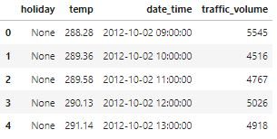

## Разведочный анализ
```python
# Информация о структуре исходных данных
metro_data.info()
```
```
<class 'pandas.core.frame.DataFrame'>
RangeIndex: 48204 entries, 0 to 48203
Data columns (total 4 columns):
 #   Column          Non-Null Count  Dtype         
---  ------          --------------  -----         
 0   holiday         48204 non-null  object        
 1   temp            48204 non-null  float64       
 2   date_time       48204 non-null  datetime64[ns]
 3   traffic_volume  48204 non-null  int64         
dtypes: datetime64[ns](1), float64(1), int64(1), object(1)
memory usage: 1.5+ MB
```

```python
# Основные статистики строковых данных
metro_data.describe(include=object)
```
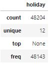

```python
# Вывод загрузки метро в разрезе времени
metro_data.plot(x='date_time', y='traffic_volume', figsize=(20, 5))
plt.show()
```
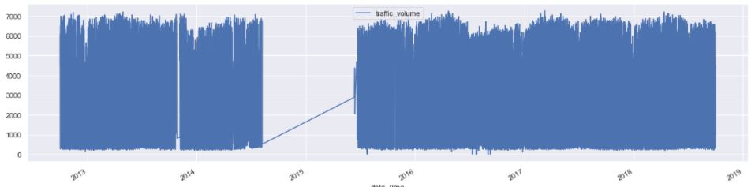

## Предобработка данных
```python
# Восстановление равномерности временных интервалов и 
# заполнение образовавшихся пропусков
metro_df = metro_data.set_index('date_time')
metro_df = metro_df.resample('H').min().interpolate(method='pad')

# Указание нужного порядка столбцов 
metro_df = metro_df[['traffic_volume', 'holiday', 'temp']]

# Вывод результата
metro_df.head()
```
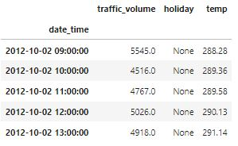

```python
# Информация о структуре данных
metro_df.info()
```
```
<class 'pandas.core.frame.DataFrame'>
DatetimeIndex: 52551 entries, 2012-10-02 09:00:00 to 2018-09-30 23:00:00
Freq: H
Data columns (total 3 columns):
 #   Column          Non-Null Count  Dtype  
---  ------          --------------  -----  
 0   traffic_volume  52551 non-null  float64
 1   holiday         52551 non-null  object 
 2   temp            52551 non-null  float64
dtypes: float64(2), object(1)
memory usage: 1.6+ MB
```

## Построение модели
```python
# Функция создания дополнительных признаков 
def create_features(dataframe):
    result_df = dataframe.copy()
    
    # Кодирование времени суток с помощью sin и cos (циферблат)
    result_df['weekday'] = result_df.index.weekday
    result_df['hour'] = result_df.index.hour
    result_df['hour_sin'] = np.sin(2 * np.pi * result_df['hour'].values / 23)
    result_df['hour_cos'] = np.cos(2 * np.pi * result_df['hour'].values / 23)
    
    # Расчет среднего значения трафика в разрезе времени суток и дней недели
    traffic_mean = result_df.groupby(['weekday', 'hour'])['traffic_volume'].mean().reset_index()
    result_df = result_df.reset_index().merge(traffic_mean, on=['weekday', 'hour'], suffixes=['', '_mean'])
    result_df = result_df.set_index('date_time').sort_index()
    result_df.index.freq = result_df.index.inferred_freq
    
    # Преобразование категориальных признаков в фиктивные переменные (прямое кодирование)
    result_df = pd.get_dummies(result_df, columns=['holiday'])
    result_df.columns = result_df.columns.str.replace(' ', '')
    
    return result_df

# Функция разбиения временного ряда на тренировочную и тестовую выборки
def timeseries_train_test_split(X_array, Y_array, test_number_week=2):
    train_idx = X_array.index < (X_array.index.max() - pd.Timedelta(str(test_number_week) + 'W'))
    
    X_train = X_array[train_idx]
    X_test = X_array[~train_idx]
    Y_train = Y_array[train_idx]
    Y_test = Y_array[~train_idx]

    return X_train, X_test, Y_train, Y_test

# Функция построения текущего временного ряда с прогнозом и доверительным интервалом
def plot_model(model, X_train, X_test, Y_train, Y_test, intervals=False, title=''):
    # Определение значений оси абсцисс
    train_idx = range(len(X_train))
    test_idx = range(len(X_train), len(X_train) + len(X_test))
    
    # Вывод текущего временного ряда и его прогноза
    Y_pred = model.predict(X_test)
    
    plt.figure(figsize=(20, 5))
    plt.plot(test_idx, Y_test.values, label='Реальные значения')
    plt.plot(test_idx, Y_pred, 'g', label='Прогнозные значения', linewidth=2.0)
    
    # Вывод доверительного интервала
    if intervals:
        score_mae = cross_val_score(model, X_train, Y_train, cv=TimeSeriesSplit(), scoring='neg_mean_absolute_error')
        lower_bound = Y_pred - (-score_mae.mean() + 1.96 * score_mae.std())
        upper_bound = Y_pred + (-score_mae.mean() + 1.96 * score_mae.std())
    
        plt.plot(test_idx, lower_bound, 'r--', label='Границы доверительного интервала', alpha=0.5)
        plt.plot(test_idx, upper_bound, 'r--', alpha=0.5)
    
    # Вывод оценки качества прогноза модели
    error = r2_score(Y_pred, Y_test)
    plt.title(title + '\n R-квадрат = {0:.3f}'.format(error))
    
    # Вывод легенды
    plt.legend(loc='best')
    plt.show()

# Функция вывода коэффициентов модели в порядке их значимости
def plot_coefficients(coefs, X_array):
    # Определение коэффициентов модели
    coefs_df = pd.DataFrame(coefs, X_array.columns, columns=['coef'])
    coefs_df['coef_abs'] = coefs_df.coef.abs()
    coefs_df = coefs_df.sort_values('coef_abs', ascending=False)
    
    # Вывод коэффициентов модели
    plt.figure(figsize=(8, 5))
    plt.bar(coefs_df.index, coefs_df.coef)
    plt.title('Коэффициенты модели')
    plt.xticks(rotation=90)
    plt.show()

# Функция построения прогноза временного ряда с помощью модели SARIMAX
def plot_SARIMAX(model, Y_test, s=168, d=1, n_steps=0, title=''):
    # Определение прогноза модели SARIMAX
    Y_pred = model.fittedvalues
    Y_pred[:s+d] = np.NaN
    
    # Определение необходимости в прогнозе будущего периода времени 
    if n_steps > 0:
        forecast = model.get_forecast(steps=n_steps)
        Y_forecast = Y_pred.append(forecast.predicted_mean)
    else:
        Y_forecast = Y_pred
    
    # Построение текущего временного ряда и прогнозных значений
    plt.figure(figsize=(20, 5))

    plt.plot(Y_test.values, label = 'Реальные значения')
    plt.plot(Y_forecast.values, color='g', label='Прогнозные значения', linewidth=2.0)
    
    # Вывод оценки качества прогноза модели
    error = r2_score(Y_pred[s+d:], Y_test[s+d:])
    plt.title(title + '\n R-квадрат = {0:.3f}'.format(error))
    
    # Вывод прогноза и доверительного интервала для будущего периода времени
    if n_steps > 0:
        intervals = forecast.conf_int(alpha=0.2)
        intervals.columns=['lower', 'upper']
        plt.plot(intervals['upper'], "r--", alpha=0.5)
        plt.plot(intervals['lower'], "r--", alpha=0.5, label = "Границы доверительного интервала")
        plt.fill_between(intervals.index, intervals['upper'], intervals['lower'], alpha=0.2, color = "grey")
    
    # Вывод легенды
    plt.legend(loc='upper left')
    plt.show()
```

```python
# Добавление новых признаков и удаление данных за предыдущие годы
metro_features_df = create_features(metro_df[metro_df.index.year > 2017])
metro_features_df.iloc[1]
```
```
traffic_volume                   1408.000000
temp                              249.080000
weekday                             0.000000
hour                                1.000000
hour_sin                            0.269797
hour_cos                            0.962917
traffic_volume_mean               407.641026
holiday_IndependenceDay             0.000000
holiday_LaborDay                    0.000000
holiday_MartinLutherKingJrDay       0.000000
holiday_MemorialDay                 0.000000
holiday_NewYearsDay                 0.000000
holiday_None                        1.000000
holiday_StateFair                   0.000000
holiday_WashingtonsBirthday         0.000000
Name: 2018-01-01 01:00:00, dtype: float64
```

```python
# Разбиение данных на тренировочную и тестовую выборки
X_train, X_test, Y_train, Y_test = timeseries_train_test_split(
    metro_features_df.iloc[:, 1:], metro_features_df.iloc[:, 0])

# Вывод данных за последние две недели
Y_test.plot(figsize=(20, 5))
plt.title('Данные за последние две недели\n(тестовая выборка)')
plt.show()
```
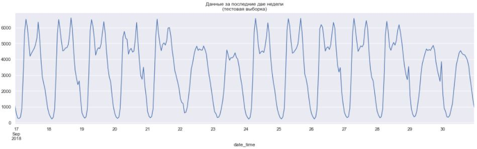

```python
# Построение прогноза временного ряда с помощью линейной регрессии
lr_model = LinearRegression().fit(X_train, Y_train)
plot_model(lr_model, X_train, X_test, Y_train, Y_test, title='Базовый прогноз на тестовой выборке')
```
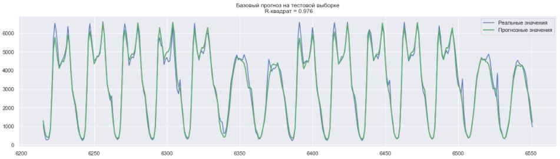

```python
# Построение прогноза временного ряда с помощью Ridge регрессии
rd_model = RidgeCV(cv=TimeSeriesSplit()).fit(X_train, Y_train)
plot_model(rd_model, X_train, X_test, Y_train, Y_test, title='Ridge прогноз на тестовой выборке')
plot_coefficients(rd_model.coef_, X_test)
```
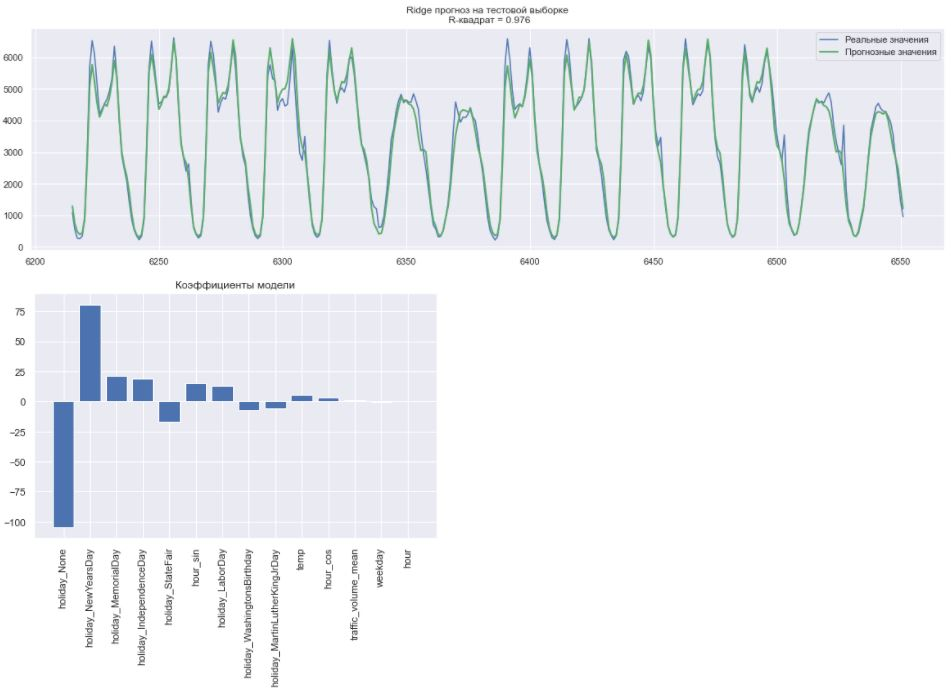

```python
# Построение прогноза временного ряда с помощью Lasso регрессии
ls_model = LassoCV(cv=TimeSeriesSplit()).fit(X_train, Y_train)
plot_model(ls_model, X_train, X_test, Y_train, Y_test, title='Lasso прогноз на тестовой выборке')
plot_coefficients(ls_model.coef_, X_test)
```
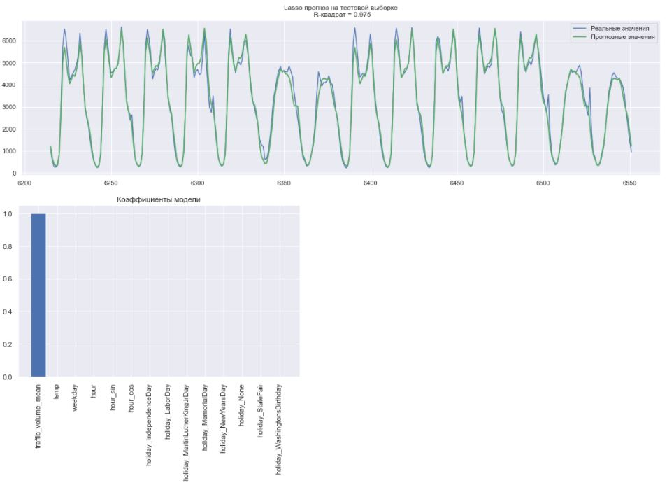

```python
# Построение прогноза временного ряда с помощью градиентного бустинга
gb_model = GradientBoostingRegressor().fit(X_train, Y_train)
plot_model(gb_model, X_train, X_test, Y_train, Y_test, title='GradientBoosting прогноз на тестовой выборке')
plot_coefficients(gb_model.feature_importances_, X_test)
```
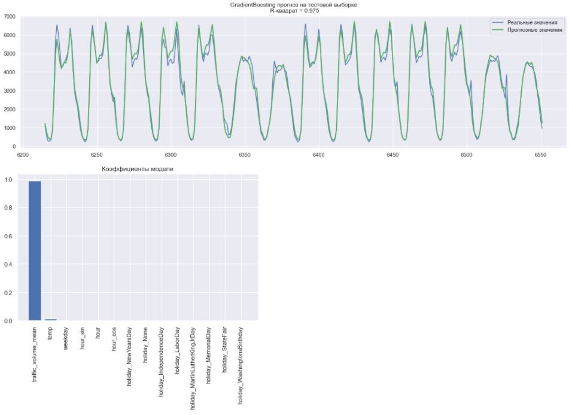

```python
# Построение прогноза временного ряда с помощью SARIMAX модели
sarimax_model = sm.tsa.SARIMAX(Y_test.reset_index(drop=True), order=(1, 1, 1), seasonal_order=(0, 1, 0, 24*7)).fit()
plot_SARIMAX(sarimax_model, Y_test, title='SARIMAX прогноз на тестовой выборке')
```
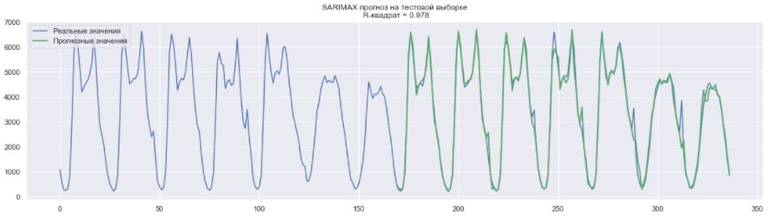

```python
# Построение прогноза на следующую неделю с помощью модели SARIMAX
plot_SARIMAX(sarimax_model, Y_test, n_steps=24*7, title='SARIMAX прогноз на следующую неделю')
```
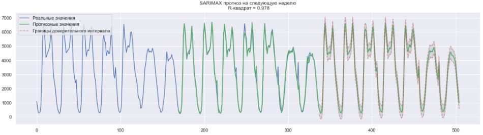
